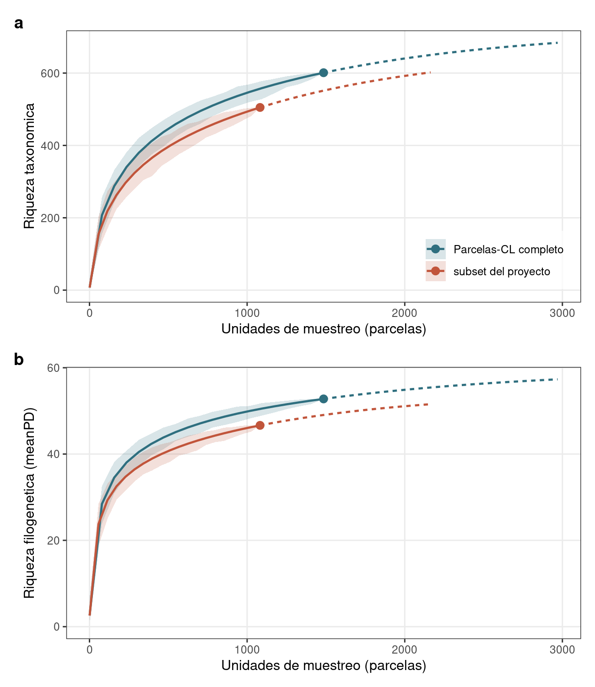
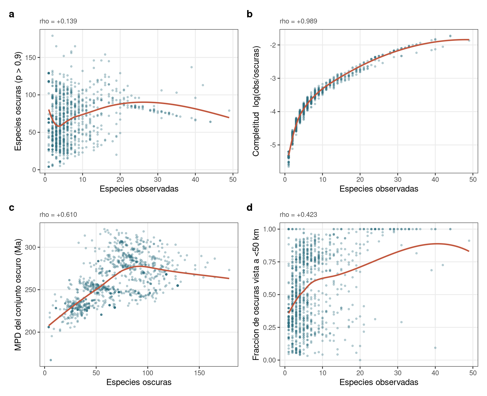

# Diversidad filogenética y curvas de acumulación

Cierra la faceta que `scripts/07_compute_taxonomic_beta_responses.R` dejó pendiente por no
haber «ninguna filogenia referenciada en este repo», y replica la Fig. 4b,c de
Cerda-Paredes et al. (2026) para saber qué costó filtrar el dataset.

| script | qué hace | salida |
|---|---|---|
| `scripts/lib/parcelas_comm.R` | resolución taxonómica y matrices de incidencia | — |
| `scripts/lib/pd_inext.R` | rarefacción/extrapolación de PD | — |
| `scripts/25_compute_phylo_responses.R` | árbol y respuestas por parcela | `phylo_tree.tre`, `phylo_species_status.csv`, `phylo_responses.parquet` |
| `scripts/26_rarefaction_inext.R` | curvas | `rarefaction_inext.csv`, `rarefaction_asymptote.csv`, `results/figures/fig15_*` |
| `scripts/27_compute_dark_diversity.R` | dark diversity | `dark_diversity.parquet`, `dark_diversity_spatial.csv`, `results/figures/fig16_*` |
| `tests/test_phylo.R` | 13 compuertas | — |
| `tests/test_dark_diversity.R` | 9 compuertas | — |

Dependencias R nuevas en esta fase: `install.packages(c("iNEXT.3D", "patchwork", "DarkDiv"))`. Se suman
a `ape`, `picante`, `arrow`, `V.PhyloMaker2` y `ggplot2`, que ya estaban. `renv.lock` sigue
sin trackear en el repo, así que no las recoge.

---

## 1. El n de Parcelas-CL: 601, no 675

El paper declara 675 especies leñosas. Desglosando `Accepted_species` por
`Accepted_name_rank` en el CSV publicado:

| rango | taxones | registros | parcelas |
|---|---:|---:|---:|
| species | 597 | 10.520 (97,2 %) | 1.484 |
| **genus** | **54** | 196 (1,8 %) | 123 |
| **family** | **7** | 30 (0,3 %) | 27 |
| subspecies | 6 | 15 | 15 |
| variety | 11 | 60 | 57 |

Los 675 suman 61 registros que nunca se determinaron a especie. Colapsando subespecies y
variedades al binomio quedan **601 binomios únicos** — cuatro de ellos existen sólo como
infraespecífico (*Adiantum poiretii*, *Anthoxanthum utriculatum*, *Calceolaria densifolia*,
*Festuca acanthophylla*).

601 es el número que un árbol puede representar. Un registro a rango de género no tiene
posición filogenética, y darle un tip inflaría la PD con largo de rama que nadie observó.
`tests/test_phylo.R` fija el 601: si cambia, o se actualizó el dataset o se rompió la
resolución de sinónimos.

## 2. El árbol

`GBOTB.extended.TPL` de **V.PhyloMaker2** (74.529 tips; backbone GBOTB de Smith & Brown
2018 extendido con Zanne et al. 2014, nomenclatura The Plant List). Escenario **S3**: las
especies ausentes se injertan en el punto medio entre el nodo basal y la corona del género.

601 tips, 336 (56 %) con posición propia del megaárbol y 265 injertadas. El injerto no es
un problema a esta escala: con 10 réplicas del escenario estocástico S2 la correlación
entre réplicas es 1,0000 para PD, MPD y MNTD. Con mediana de 5 especies por parcela, lo que
domina es *qué linajes profundos están presentes*, no dónde cae cada especie dentro de su
género.

### El problema real: 30 géneros sin familia

`phylo.maker` descarta **en silencio** toda especie cuyo género no esté en la tabla de
familias. Y esa tabla no cubre ni siquiera todos los géneros del propio megaárbol
(*Lithraea* es un tip de `GBOTB.extended.TPL` pero falta en `tips.info.TPL`).

Los géneros que desaparecían eran justo los endemismos chilenos: *Bridgesia*, *Lapageria*,
*Retanilla*, *Trevoa*, *Llagunoa*, *Podanthus*, *Laureliopsis*, *Archidasyphyllum*. Un
árbol global armado desde GenBank está mal muestreado precisamente donde esta flora es más
distintiva. Parte se recupera mapeando sinónimos, porque Parcelas-CL estandarizó con
WFO/WCVP y The Plant List está congelado en 2013 (`Neltuma`→*Prosopis*,
`Leucostele`→*Echinopsis*, `Temu`→*Blepharocalyx*, `Hesperocyparis`→*Cupressus*,
`Jarava`→*Stipa*). El resto necesita `FAMILY_MANUAL`, 30 asignaciones a mano.

Efecto: **470 → 601 tips**, y de 1.041 a **1.082 parcelas** con cobertura.

> **Pendiente de revisión botánica.** Las 30 familias de `FAMILY_MANUAL` se asignaron a mano
> y no están verificadas contra una autoridad taxonómica. El script las imprime al correr.
> Un error ahí cuelga un linaje del clado equivocado sin romper nada visible. La única con
> evidencia interna es *Gayella* → Sapotaceae, porque el `Original_species_name` del CSV es
> `Pouteria splendens`.

## 3. Presencia/ausencia, y por qué no hay alternativa

Todo se calcula sobre incidencia: `comm <- (table(...) > 0) * 1`, y `mpd`/`mntd` con
`abundance.weighted = FALSE`. La PD de Faith es presencia por definición.

No es una elección estilística. En las 1.082 parcelas la abundancia viene en tres unidades
inconmensurables más un vacío:

| `Abundance_parameter` | parcelas | unidad |
|---|---:|---|
| Cover | 546 | % de cobertura |
| Abundance | 479 | individuos |
| Basal_area | 3 | m²/ha |
| NA | 54 | ninguna |

Ponderar mezclaría «40 % de cobertura» con «40 individuos» y dejaría 57 parcelas fuera. El
MPD ponderado sería un artefacto del protocolo del contribuyente — exactamente el
confundido que ya se come la α (`Owner` explica el 70 % de la varianza de log-riqueza).

Lo que sí sería limpio, si se quiere usar abundancia: MPD/MNTD ponderados y Rao's Q **sólo
en el estrato de 546 parcelas de cobertura**, como tier adicional con máscara, igual que
`TARGETS_COVER` con `MaskedHuberLoss`. No implementado.

## 4. Qué sirve como target

Spearman contra la riqueza (n = 1.082, 113 parcelas sin cobertura → NA):

| métrica | r con riqueza | veredicto |
|---|---:|---|
| `pd_faith` | **+0,948** | descriptor, **no target** — es riqueza reetiquetada |
| `mpd` | +0,123 | casi ortogonal: información nueva |
| `mntd` | −0,503 | parcialmente independiente |
| `ses_pd` | −0,010 | ✓ |
| `ses_mpd` | +0,069 | ✓ |
| `ses_mntd` | −0,063 | ✓ |

Los SES usan el nulo `taxa.labels` (baraja las etiquetas del árbol), que pregunta si los
linajes de la parcela están más o menos emparentados **a igual riqueza**. Que los tres
queden bajo |0,07| es la comprobación de que hace su trabajo.

`include.root = FALSE` en `pd()` y `ses.pd()`: con `TRUE`, `node.age()` aborta porque podar
el árbol a las especies de una comunidad puede dejar la raíz con un solo hijo, y con 499
aleatorizaciones eso ocurre casi seguro. Observado y nulo usan el mismo criterio, que es lo
que hace que el SES signifique algo.

## 5. Las curvas

La Fig. 4b,c del paper tiene tres rasgos que la identifican: tramo sólido hasta el n
observado con el punto marcado, tramo punteado extrapolado hasta ~2n, y banda. Eso es
**iNEXT**, no un remuestreo. Y la diferencia es de fondo: un remuestreo sólo puede
interpolar —termina en lo observado por construcción— mientras que iNEXT extrapola con el
estimador de Chao, que es lo que responde la pregunta que motiva la figura.

El eje del panel c del paper llega a ~60, no a decenas de miles: es `meanPD`, la PD dividida
por la profundidad del árbol (**390,7 Ma** en el nuestro), leíble como número efectivo de
linajes.

### Reimplementación de la PD, y por qué

La parte taxonómica la hace `iNEXT.3D::iNEXT3D` en 0,7 s. La filogenética **no escala**:
medido con 6 nudos y sin bootstrap, 89 s con n=100 y 315 s con n=200 — crecimiento
cuadrático, unas 5 h para n=1.485 por conjunto y por tipo de PD.

`scripts/lib/pd_inext.R` implementa el mismo estimador (Chao et al. 2015, *MEE* 6:380-388)
con álgebra matricial: **0,08 s** para la curva completa. La compuerta que lo autoriza está
en `tests/test_phylo.R` — reproduce la salida de iNEXT.3D con error relativo máximo
**3 × 10⁻¹⁴**, interpolación y extrapolación incluidas. Sin esa comprobación la ganancia de
velocidad no valdría nada: sería una curva rápida y posiblemente equivocada.

### La banda: dos intentos fallidos antes del bueno

Ambos fallos eran visibles —la banda no contenía su propia línea— y ambos están anotados en
el código para que nadie los repita:

1. **Bootstrap de parcelas con reemplazo.** Una muestra de T parcelas contiene sólo ~63 % de
   parcelas distintas; las copias no aportan especies, así que la curva rarefaccionada queda
   sistemáticamente por debajo.
2. **Bootstrap paramétrico con π = Y/T.** Cada especie singleton desaparece con probabilidad
   (1−1/T)^T = 0,37, así que cada réplica pierde ~37 % de los singletons y su largo de rama.
   iNEXT compensa eso simulando además las f₀ especies no detectadas — que en un árbol no se
   pueden añadir sin inventar de dónde cuelgan. Medido: banda en meanPD 48,5–50,6 contra una
   curva en 52,8.

Lo que se usa es **submuestreo sin reemplazo** (`subsample_band()`), que es la dispersión
exacta de la cantidad que la curva estima como media y por tanto está centrada por
construcción — la convención de `vegan::specaccum`. Se aplica también al panel taxonómico,
aunque iNEXT trae la suya, para que las dos bandas signifiquen lo mismo: mezclarlas invita a
leer la diferencia de anchura entre paneles como una propiedad de los datos cuando sería del
método.

**Cubre sólo el tramo interpolado.** Para el extrapolado no hay análogo por submuestreo y se
deja sin banda, que es la lectura honesta: la incertidumbre de la extrapolación vive justo
en las especies que no se han visto.

## 6. Resultados

| | n | observado | a 2n | asíntota Chao2 |
|---|---:|---:|---:|---:|
| **Riqueza taxonómica** | | | | |
| Parcelas-CL completo | 1.485 | 601 | 683,7 (+13,8 %) | **724,4 ± 24,4** |
| subset del proyecto | 1.082 | 505 | 602,0 (+19,2 %) | 668,6 ± 28,5 |
| **meanPD** | | | | |
| Parcelas-CL completo | 1.485 | 52,8 | 57,3 (+8,6 %) | — |
| subset del proyecto | 1.082 | 46,6 | 51,6 (+10,5 %) | — |

Tres lecturas:

1. **Se reproduce el hallazgo del paper**: la curva filogenética satura antes que la
   taxonómica (+8,6 % contra +13,8 % al duplicar el esfuerzo). Muestrear más suma especies
   mucho más rápido que suma linaje.
2. **A Parcelas-CL le falta el 17 % de la flora leñosa** por muestrear, según su propio
   patrón de singletons. Al subset le falta el 24 %.
3. **Filtrar costó menos de lo que parece.** A igual esfuerzo el subset retiene el 89,8 % de
   las especies y el **92,9 %** de la PD. Y por debajo de ~100 parcelas el subset va *por
   encima* del dataset completo (102 % de especies, 109 % de PD con 20 parcelas): concentrado
   en Chile central, cada parcela aporta más linaje nuevo que la parcela media del conjunto,
   que incluye el sur boscoso donde se repiten los mismos congéneres.

> El comparativo grueso «84 % de especies / 88 % de PD» que circuló antes comparaba los
> extremos de las dos curvas, que están a n distinto (1.082 contra 1.485). Los números de
> arriba son a igual esfuerzo, interpolando sobre rejilla común.

## 7. Lo que el paper no documenta

Cerda-Paredes et al. (2026) reportan diversidad filogenética en su Fig. 4c pero **no
documentan el árbol ni el método**: la sección de métodos no menciona filogenia, ni paquete,
ni referencia de backbone. Del pie de figura («lineage diversity for Hill number 0», con
interpolación y rarefacción) sólo se infiere la familia de métodos.

Por eso el árbol de aquí es propio y queda documentado. Vale la pena pedirle el `.tre` a los
autores: si el suyo difiere, las dos Fig. 4c no son comparables y eso conviene saberlo antes
de citarlas juntas.

## 8. Dark diversity

Las especies que **podrían** estar en una parcela y no están (Pärtel, Szava-Kovats & Zobel
2011). Estimada por co-ocurrencia con `DarkDiv` 0.3.0 (Carmona & Pärtel 2021, *GEB*
30:316-326), método hipergeométrico.

### Tres decisiones, cada una medida

**1. El pool se estima con las 1.485 parcelas, no con las 1.082 del subset** — aunque sólo
se reporten las del subset. Con el pool reducido la dark diversity se contamina de esfuerzo
de muestreo: ρ con log(área) sube de +0,085 a **+0,315**, y R² por contribuyente de 0,22 a
0,41. Las dos versiones correlacionan 0,958 entre sí, así que es la misma señal más limpia.
Más parcelas de co-ocurrencia dan mejor estimación aunque caigan fuera del área de estudio.

**2. Se cuenta con umbral, no sumando probabilidades.** `DarkDiv` devuelve una probabilidad
de pertenencia por especie ausente, y la práctica de sumarlas todas da aquí una mediana de
**253 especies oscuras** para parcelas con mediana de 5 observadas. Afirmar que una parcela
de 400 m² en Chile central podría albergar 253 leñosas más no es un resultado: la mediana de
esas probabilidades es 0,38, y sumar 596 números pequeños da un número grande. Contando sólo
las que superan 0,9 quedan ~63, y el estimador deja de ser riqueza disfrazada.

Sensibilidad (ρ contra la riqueza observada):

| umbral | 0,50 | 0,70 | 0,80 | **0,90** | 0,95 | 0,99 |
|---|---:|---:|---:|---:|---:|---:|
| especies oscuras (mediana) | 181 | 114 | 88 | **63** | 46 | 28 |
| ρ con la riqueza | +0,433 | +0,221 | +0,176 | **+0,151** | +0,163 | +0,187 |

Por debajo de 0,8 el conteo hereda la riqueza; por encima, la conclusión no depende del
umbral. 0,9 está en la meseta.

**3. La completitud no sirve como target** — resultado negativo, fijado en el test para que
nadie lo «arregle». `log(observadas/oscuras)` correlaciona **+0,988** con la riqueza
observada y +0,987 con `hill_q0`. Es riqueza reetiquetada, exactamente igual que la PD de
Faith, y por la misma razón estructural: la riqueza está en el numerador y la dark diversity
varía poco entre parcelas, así que el cociente es monótono en riqueza. Es incómodo porque la
completitud se propuso *precisamente* como la medida independiente del tamaño del pool.

### Validación espacial

La objeción obvia: estimar co-ocurrencia sobre 30–55 °S podría adjudicarle especies
patagónicas a una parcela de Coquimbo. El método debería filtrarlo solo, pero eso hay que
comprobarlo. Se mide qué fracción de las especies oscuras de cada parcela se ha observado de
verdad cerca — **y la misma fracción para una ausente cualquiera**, que es la línea base.

| radio | oscuras vistas cerca | ausente cualquiera | razón |
|---|---:|---:|---:|
| 25 km | 32,4 % | 8,4 % | **3,8×** |
| 50 km | 45,8 % | 16,6 % | 2,8× |
| 100 km | 72,9 % | 28,6 % | 2,6× |
| 200 km | 88,7 % | 39,0 % | 2,3× |

El pool es local, no una lista nacional. El número absoluto solo (45,8 % a 50 km) parece
malo hasta que se ve la línea base: por eso se mide contra ella.

### Robustez al método

Aplicar el mismo umbral 0,9 al método `Favorability` y comparar conteos da ρ = **+0,12**, que
parecería una contradicción entre métodos. No lo es: las escalas no son intercambiables — el
11 % de las celdas hipergeométricas supera 0,9 contra el 2,6 % de las de favorability. A
conteo igualado (top-k por parcela, k = las oscuras del hipergeométrico) el **Jaccard mediano
es 0,556**, y la correlación de rangos entre las dos matrices completas es **+0,706** sobre
881.905 celdas. Lo que no es robusto es el umbral absoluto, no el orden de las candidatas.

### Qué sirve como target

| métrica | ρ riqueza | ρ log(área) | R² Owner | hill_q0 | pcoa1_pa | lcbd_pa | veredicto |
|---|---:|---:|---:|---:|---:|---:|---|
| **`dark_n`** | **+0,151** | **+0,085** | **0,22** | +0,142 | −0,246 | +0,007 | **target nuevo** |
| `pool_n` | +0,266 | +0,107 | 0,23 | +0,274 | −0,218 | +0,048 | secundario |
| `dark_pd` | +0,226 | +0,143 | 0,29 | +0,218 | −0,373 | −0,058 | ρ=0,96 con `dark_n`: redundante |
| `dark_mpd` | +0,385 | **+0,504** | 0,44 | +0,454 | −0,457 | −0,142 | artefacto de área |
| `dark_prob` | +0,627 | +0,094 | 0,41 | +0,679 | +0,083 | +0,400 | media riqueza |
| `completeness` | **+0,988** | +0,251 | 0,47 | +0,987 | −0,081 | +0,023 | riqueza reetiquetada |

**`dark_n` es la única faceta nueva que sale de aquí, y es buena**: casi ortogonal a la
riqueza, poco dependiente del área de parcela, y con la menor dependencia del contribuyente
de todos los targets del proyecto (R² = 0,22 contra 0,70 de la log-riqueza). Ese último punto
importa más de lo que parece — el confundido con `Owner` es lo que hunde la α bajo
`kfold5_window`, y `dark_n` lo sufre mucho menos.

La PD del conjunto oscuro (`dark_pd`) cae en la misma trampa que la PD de Faith: ρ = 0,96 con
el conteo de especies oscuras. El MPD del conjunto oscuro sí es otra cosa conceptualmente
—responde si lo que falta son 60 congéneres o 60 familias— pero ρ = +0,504 con el área de
parcela lo descalifica: mide protocolo, no ecología.

## 9. Pendiente

- Revisión botánica de las 30 familias de `FAMILY_MANUAL` (§2).
- MPD/MNTD ponderados y Rao's Q en el estrato de cobertura (§3).
- Las métricas filogenéticas aún no se han evaluado bajo `kfold5_window`, que
  `docs/10_findings.md` §1b fija como esquema primario único.
