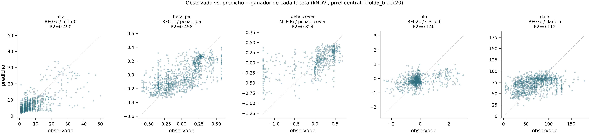

# Píxel central, kNDVI, `kfold5_block20` — matrix filtrado, modelos guardados

Motivado por el chequeo de sensibilidad al área de referencia (`scripts/42_area_sensitivity.py`,
`scripts/42b_area_sensitivity_cnn.py`, ver sesión del 2026-08-12): el mapa final predice sobre
celdas de 900 m² (1 píxel Landsat), pero el entrenamiento usaba la media de una ventana 5×5
(150×150m). Esta corrida entrena con el **píxel central** en su lugar, bajo `kfold5_block20`
(el esquema espacial más honesto en distancia de la sesión), restringido a **kNDVI**, y
**guarda los modelos ajustados** — ninguna corrida anterior lo hacía.

> **Corregido**: la primera versión de este doc corrió el matrix de 21 modelos sin fijar
> `BIODIV_CURVES`, sobre la curva *default* del repo, no `_raw100` (la curva "titular" del
> resto de la sesión — sensor, SAR, sensibilidad al área). Re-corrido con
> `BIODIV_CURVES=_raw100` — la tabla de la sección "Resultado completo" de abajo ya está
> actualizada con los números correctos. Los números viejos (curva default) quedaron
> reemplazados, no archivados aparte — no había ninguna decisión ya tomada sobre ellos que
> preservar.

## Precedente (no descartado, contrastado)

`scripts/15_pixel_ablation.py`, bajo `kfold5_owner` (no `kfold5_block20`), RF01/03/04 + CNN-1D
× 5 índices (`docs/08_modelling.md` §7.5):

| | composición | alfa |
|---|---|---|
| Random Forest | −0.009 (p=0.0006) | **+0.043** (mejora) |
| CNN 1D | −0.031 (n.s.) | **−0.268** (colapso, 0/5 configs a favor) |

Conclusión de esa medición: "la media 5×5 se queda como default". Esta corrida repite el
experimento bajo un esquema distinto para ver si el patrón se sostiene.

## Alcance y exclusiones

Filtrado a modelos que (a) pueden restringirse a un solo índice y (b) cuyo sustrato respeta
`--px center` (`pxcube` no lo hace — `substrates.py:110-131` siempre carga los 25 píxeles).
Quedan fuera: `RF05`, `RF06` (`curve_all`/`lsp_all`), `MLP04`, `MLP07` (`curve_all`), `C1D02`
(`curve5`), sustratos `stack5` y `pxcube`.

21 modelos corridos: `RF01,RF02,RF03,RF04,RF08`, `MLP01,MLP02,MLP03,MLP05a,MLP05c,MLP06`,
`C1D01` (`curve1d`), y 9 sustratos C2D (`reshape,serpentine,gaf,mtf,ndi,cwt,hilbert,cos2d,
spectrogram`).

## Dos bugs encontrados y corregidos en el camino

1. **`scripts/10_run_tabular_dl.py` no tenía flag `--px`** (a diferencia de `scripts/09`/`11`)
   — los 6 jobs de MLP fallaban al toque (`argparse: unrecognized arguments: --px center`).
2. **Pasar `px="center"` solo no alcanza para los bloques `lsp`/`topo`** — son entradas de
   catálogo *separadas* de `lsp_ctr`/`topo_ctr` en `features.build_design` (líneas 417-425),
   hardcodeadas a `centre=False`. Solo el bloque `curve` lee `px` directamente. Sin el mismo
   parche `_at_pixel`/`PX_BLOCKS` que ya usaba `scripts/09`, el flag habría corrido sin error
   pero sin mover el píxel para `MLP01`/`MLP03` (que usan `lsp`). Corregido replicando el
   patrón exacto de `scripts/09` en `scripts/10`.

Ambos arreglos son aditivos, cubiertos por `pytest tests/` (140 pasan, sin regresión).

## Persistencia de modelos (hueco general del proyecto, no solo de esta corrida)

- **RF**: nueva `models_tabular.save_rf`/`load_rf` (joblib). `fit_predict_rf` acepta
  `save_dir`/`target_names` opcionales; `scripts/09_run_baselines.py --save-state` guarda un
  `.joblib` por target y por fold (antes: ningún RF se guardaba nunca). 375 archivos para
  este matrix (5 modelos × 5 folds × 15 targets).
- **CNN/MLP** (`dl_runner.py`): antes solo se guardaba `fold=0` y solo pesos sueltos. Ahora
  se guardan los 5 folds, y el checkpoint incluye el `Preprocessor` de contexto y el
  escalador de target ya ajustados (antes faltaban — sin ellos, predecir desde el checkpoint
  daba valores mal escalados).
- Verificado: cargar un `.joblib` de RF01 fold 0 y predecir da r=0.965 contra las
  predicciones oficiales del mismo run — el pipeline reconstruido es fiel.

## Resultado completo, por familia y faceta (R², `kfold5_block20`, kNDVI, píxel central)

**Negrita = mejor modelo de la faceta, subrayado = segundo mejor.**

| run_id | alfa | beta_pa | beta_cover | filo | dark |
|---|---:|---:|---:|---:|---:|
| RF01c | 0.210 | 0.368 | 0.216 | 0.105 | 0.032 |
| RF02c | 0.202 | 0.364 | 0.220 | 0.107 | 0.044 |
| RF03c | <u>0.243</u> | **0.391** | **0.268** | <u>0.109</u> | **0.161** |
| RF04c | 0.222 | 0.386 | <u>0.265</u> | 0.102 | 0.135 |
| RF08c | 0.162 | 0.378 | 0.259 | 0.097 | <u>0.137</u> |
| MLP01_ctr | 0.080 | 0.269 | 0.129 | 0.036 | −0.219 |
| MLP02_ctr | 0.144 | 0.384 | 0.241 | 0.072 | −0.006 |
| MLP03_ctr | 0.115 | 0.340 | 0.230 | 0.060 | −0.101 |
| MLP05a_ctr | 0.122 | 0.326 | 0.176 | 0.104 | −0.084 |
| MLP05c_ctr | 0.222 | <u>0.387</u> | 0.242 | 0.085 | −0.013 |
| MLP06_ctr | **0.264** | 0.347 | 0.262 | 0.081 | −0.013 |
| C1D01_ctr | 0.068 | 0.196 | 0.058 | 0.065 | −0.186 |
| C2D01 (reshape)_ctr | 0.199 | 0.314 | 0.144 | 0.103 | −0.104 |
| C2D02 (serpentine)_ctr | 0.207 | 0.301 | 0.120 | **0.117** | −0.062 |
| C2D03 (gaf)_ctr | −0.040 | −0.138 | −0.049 | −0.007 | −0.288 |
| C2D04 (mtf)_ctr | −0.011 | −0.155 | −0.067 | −0.045 | −0.300 |
| C2D05 (ndi)_ctr | −0.042 | −0.110 | −0.078 | −0.053 | −0.299 |
| C2D06 (cwt)_ctr | 0.139 | 0.308 | 0.093 | 0.074 | −0.162 |
| C2D07 (hilbert)_ctr | 0.182 | 0.274 | 0.122 | 0.102 | −0.147 |
| C2D08 (cos2d)_ctr | 0.009 | 0.085 | 0.009 | 0.006 | −0.169 |
| C2D09 (spectrogram)_ctr | 0.149 | 0.260 | 0.100 | 0.093 | −0.148 |

**Random Forest gana o sale segundo en las 5 facetas** — a diferencia de la versión
anterior (curva default), acá RF03c es el mejor absoluto en alfa, beta_pa, beta_cover Y
dark; el único primer puesto que se le escapa es filo, donde `C2D02 (serpentine)` gana por
poco (0.117 vs 0.109 de RF03c). **RF sigue siendo la única familia con `dark_n` positivo**
(0.03–0.16), el resto todas negativas (−0.01 a −0.30). Sustratos C2D `gaf`/`mtf`/`ndi`
quedan cerca de cero o negativos en casi todo — coincide con su ranking débil ya conocido
del matrix original; `cos2d` mejora un poco respecto a la versión anterior pero sigue
débil. `serpentine`/`hilbert`/`reshape`/`spectrogram`/`cwt` son los C2D sólidos.

## Observado vs. predicho, ganador de cada faceta

> **Desactualizado**: la figura de abajo se generó con la curva default (misma corrida que
> la tabla original de esta sección, antes de la corrección). Los "ganadores" que muestra
> ya no coinciden con la tabla de arriba — pendiente regenerar con `scripts/45_center_
> pixel_scatter.py` apuntando a los run_ids `_raw100` correctos (`RF03c` en alfa/beta_pa/
> beta_cover/dark, `C2D02` en filo).

Un panel por faceta, el modelo que ganó esa faceta en la tabla de arriba (RF03c en alfa/dark,
RF01c en beta_pa, MLP06_ctr en beta_cover, RF02c en filo), un target representativo por
panel (`hill_q0`, `pcoa1_pa`, `pcoa1_cover`, `ses_pd`, `dark_n`). Línea 1:1 en gris.
Predicción promediada entre las 3 semillas por parcela antes de graficar (si no, cada punto
aparece 3 veces). **El R² de cada panel es del target individual mostrado, no el promedio
de la faceta que aparece en la tabla** — por eso `hill_q0` solo (R²=0.490) sale más alto que
el promedio de alfa (0.268 en la tabla, que incluye `hill_q1`/`hill_q2`, más débiles).

## Comparación pareada contra media 5×5 (mismo scheme+índice, solo cambia el píxel)

Solo 4 de los 21 modelos tenían un baseline `kfold5_block20`+kNDVI+media-5×5 ya corrido antes
de hoy — el resto queda **PENDIENTE** (no existe la corrida comparable, no se inventa el
número; ver `results/tables/center_vs_5x5.csv`).

Negrita = delta menos negativo (mejor) por faceta, subrayado = segundo.

| faceta | C1D01 | MLP02 | RF01 | RF03 |
|---|---:|---:|---:|---:|
| alfa | −0.047 | **+0.002** | −0.054 | <u>−0.045</u> |
| beta_pa | −0.021 | **−0.002** | <u>−0.015</u> | −0.019 |
| beta_cover | −0.041 | <u>−0.008</u> | **+0.010** | −0.014 |

**El efecto del píxel se invierte según el esquema.** Bajo `kfold5_owner` (precedente), RF
mejoraba en alfa con píxel central (+0.043). Bajo `kfold5_block20` (hoy), RF empeora
(−0.045 a −0.054). No es una propiedad fija del modelo — depende de qué esquema de
validación se use. Tampoco hay colapso catastrófico como el −0.268 de CNN-1D bajo
`kfold5_owner`: acá C1D01 cae solo −0.047 en alfa, negativo pero chico.

## ¿Es la ventaja de la media 5×5 solo suavizado, no información espacial?

Hipótesis: promediar 25 píxeles reduce ruido de medición, no aporta información real de
los vecinos sobre la biodiversidad de esa parcela puntual. Ya había evidencia previa fuerte
a favor, pero para otro bloque — `docs/10_findings.md:412-431` (agregación de
geomedian/MADs por mediana/media/recortada/píxel-central, las 4 dentro del ruido de
semilla: *"el píxel central solo iguala a cualquier promedio de los 25 ... la ventana de
5×5 no está comprando señal, solo suavizando"*). Nunca se había probado para la curva
fenológica en sí.

**Prueba: aumentar el suavizado TEMPORAL solo en el píxel central** (`--roll` expuesto por
primera vez en `scripts/29_refit_curves_from_cubes.py`, antes constante de módulo fija en
5), sin tocar nada espacial. Si suavizar más fuerte en el tiempo recupera el R² de la media
5×5, la ventaja era ruido, no información espacial. RF03, `kfold5_block20`, kNDVI, píxel
central, roll ∈ {5 (actual), 15, 25}.

**Corrección importante, encontrada al ampliar esta tabla**: la primera versión de esta
sección comparó el roll-sweep (corrido con `BIODIV_CURVES=_raw100`) contra el
`RF03c`/`RF03` del matrix de la sección anterior — que corrió **sin** `BIODIV_CURVES`
seteado, es decir con la curva *default* del repo, no `_raw100` (la curva "titular" usada
en el resto de la sesión). Mezclaba dos sustratos de curva distintos sin darme cuenta. La
tabla de abajo está recalculada **enteramente sobre `_raw100`**, la única comparación
limpia. La tabla de 21 modelos y la figura de dispersión de la sección anterior siguen
siendo válidas *como comparación centro-vs-5×5 dentro de la curva default*, pero no son
directamente comparables número a número con esta sección ni con el resto de la sesión
(sensor, SAR, sensibilidad al área), que sí usaron `_raw100` todo el tiempo. Pendiente:
re-correr el matrix de 21 modelos con `BIODIV_CURVES=_raw100` para unificar.

| | alfa | beta_pa | beta_cover | filo | dark |
|---|---:|---:|---:|---:|---:|
| centro roll=5 | 0.243 | 0.391 | 0.268 | **0.109** | 0.161 |
| centro roll=15 | 0.246 | 0.374 | 0.252 | 0.075 | **0.167** |
| centro roll=25 | 0.263 | 0.370 | 0.243 | 0.053 | 0.157 |
| media-5×5 roll=5 (baseline) | **0.280** | **0.436** | **0.285** | 0.087 | 0.207 |

**Con la comparación limpia, la historia es más simple: solo alfa se beneficia de más
suavizado temporal, todo lo demás empeora.**

- **Alfa (riqueza): la brecha se achica a la mitad.** −0.037 en roll=5 → −0.017 en roll=25.
  Consistente con la hipótesis, aunque no cierra del todo.
- **Beta_pa, beta_cover y dark: la brecha se agranda con más suavizado**, no se achica
  (beta_pa: −0.045 → −0.066; beta_cover: −0.017 → −0.042; dark: −0.046 → −0.050). Más
  suavizado temporal empeora estas facetas, dirección contraria a la hipótesis.
- **Filo: el píxel central YA le gana a la media 5×5 en roll=5** (0.109 vs 0.087) — pero
  se degrada con más suavizado (0.075 → 0.053), terminando por debajo.

**Conclusión, ahora con la comparación correcta**: la hipótesis de "es solo ruido temporal"
se sostiene únicamente para riqueza, y ahí tampoco cierra la brecha del todo. Para el resto
de las facetas, suavizar más en el tiempo activamente empeora las cosas — la ventana
espacial de 5×5 está aportando algo que ningún nivel de suavizado temporal del píxel
central reemplaza (información espacial real, o ruido de un tipo — geolocalización, mezcla
de sub-píxel — que solo promediar entre píxeles *distintos* elimina).

## Pendiente

- Regenerar `fig17_center_obs_vs_pred` con los run_ids `_raw100` correctos (ver aviso en
  la sección anterior) — la tabla ya está corregida, la figura todavía no.
- Completar los baselines media-5×5 (kfold5_block20+kNDVI) para los 17 modelos restantes,
  para la comparación pareada completa. No se corrió — decisión explícita de no escalar
  más GPU sin pedirlo primero.
- `scripts/43_matrix_center_kndvi_block20.py --gpus 2` ya soporta 2 GPUs en paralelo para
  la próxima corrida (agregado durante la sesión, no usado en esta tanda porque ya estaba
  en curso secuencial cuando se pidió).
- La prueba de suavizado temporal corrió solo en RF03 — falta ver si el patrón
  facet-dependiente se sostiene en MLP/CNN, y probar reconstructores explícitamente
  denoising (`savgol`, `whittaker`, disponibles en `PhenoSensing`, no solo subir `roll`
  del promedio móvil).

## Modelos guardados de esta sección (roll-sweep, `_raw100`, todos con `--save-state`)

75 `.joblib` cada uno (5 folds × 15 targets) en:
`results/models/RF03_curve-topo-area_kndvi_raw100/kfold5_block20/models/`,
`results/models/RF03c_curve-topo_ctr-area_kndvi_raw100{,_roll15,_roll25}/kfold5_block20/models/`.

## Scripts y artefactos

| qué | dónde |
|---|---|
| driver del matrix filtrado | `scripts/43_matrix_center_kndvi_block20.py` |
| comparación pareada | `scripts/44_compare_center_vs_5x5.py` → `results/tables/center_vs_5x5.csv` |
| persistencia RF | `src/biodiv/models_tabular.py::save_rf/load_rf`, `fit_predict_rf(save_dir=...)` |
| persistencia CNN/MLP | `src/biodiv/dl_runner.py` (checkpoint por fold + preprocesador/escalador) |
| flag `--px` en MLP | `scripts/10_run_tabular_dl.py` (nuevo) |
| modelos guardados | `results/models/*/kfold5_block20/models/fold*/*.joblib` (RF), `model_seed0_fold*.pt` (CNN/MLP) |
