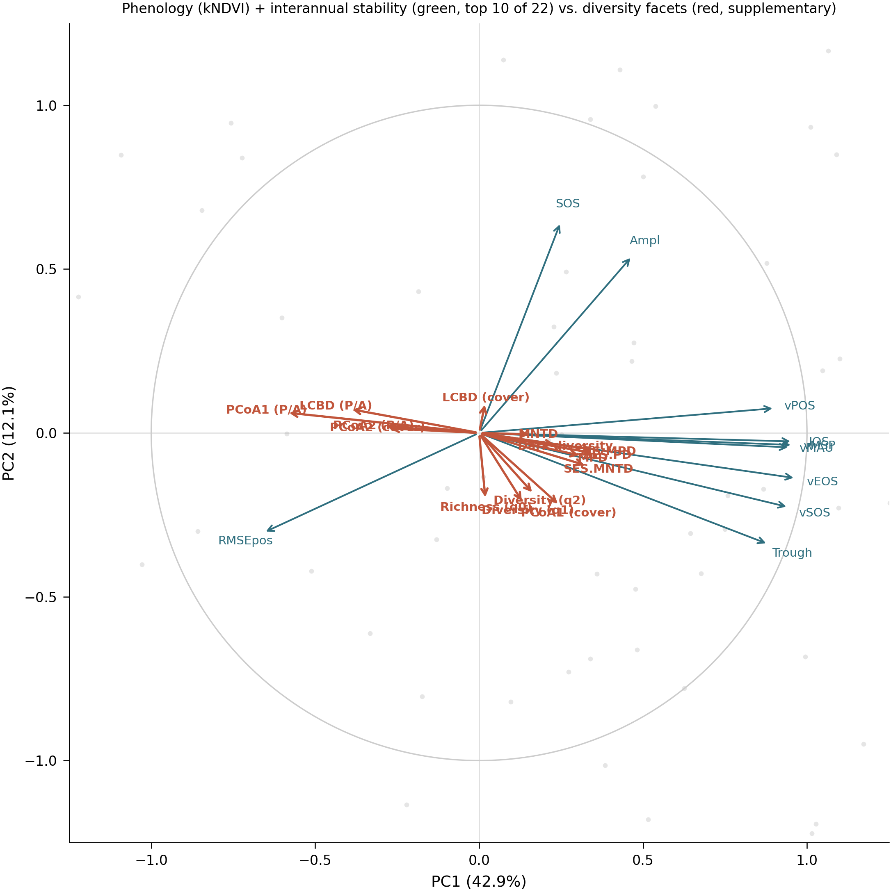

# Estabilidad interanual (Lopatin 2023) + PCA de LSP con facetas de diversidad pasivas

Referenciado en `docs/01_state_of_the_art.md:39` como método de Lopatin et al. (2023, IEEE
GRSL) pero nunca calculado en este proyecto. Objetivo: agregar una métrica de estabilidad
fenológica interanual a las 18 métricas LSP ya existentes, y ver cómo se distribuyen las 15
facetas de diversidad en ese espacio de predictores vía PCA.

## 1. Bug corregido en PhenoSensing antes de usar el método

`get_timeseries_metrics` (`accessor.py:361-529`) es la función correcta, pero tenía un bug
de una línea, ya señalado como Riesgo R9 en `docs/02_innovation_and_impact.md:59`: el RMSE
se comparaba contra el cubo completo `ds` en vez de contra la ventana `sample` ya recortada.

```python
# accessor.py:479-486, antes
rmse_val = phenoshape.pheno.RMSE(ds, LSP_stack=lsp, ...)   # BUG: cubo completo, no `sample`
```

Corregido (`ds` → `sample`) en el repo de PhenoSensing, commit `ddaa3bc`. Verificado: mismos
5 tests preexistentes fallan con o sin el fix (confirmado con `git stash`), nada roto por el
cambio. Repositorio separado de Biodiversity_Chile — commit ahí, no acá.

## 2. Qué mide exactamente con estos datos

Cada parcela tiene una sola ventana causal de 3 años (no una serie larga con ventanas
deslizantes, el uso típico del método). Con `window_length=3` sobre un cubo que ya abarca
exactamente 3 años, la función da **una sola ventana** — el RMSE mide qué tan bien la curva
ajustada a los 3 años predice las observaciones crudas dentro de esa misma ventana
(consistencia/bondad de ajuste interna), no una comparación explícita año-1 vs año-2 vs
año-3. Sigue siendo una métrica de estabilidad legítima (más residuo = fenología menos
predecible en el período), pero no es literalmente "diferencia entre años calendario".

## 3. Cálculo

`scripts/47_interannual_stability.py` — por parcela, `obs_kndvi` → `get_timeseries_metrics
(window_length=3, metric=["rmse","rmse_sos","rmse_pos","rmse_eos"], rollWindow=5, nGS=52,
hemisphere="auto")`, mismos parámetros que `scripts/02_extract_phenology.py`. Agregación de
25 píxeles a 1 valor por parcela: `np.nanmean`, mismo criterio que `mean5x5` ya usa para LSP
(`scripts/04_recompute_lsp.py:234`).

**1.082/1.082 parcelas con valor** (ninguna con menos de 3 años calendario distintos de
observaciones). Sin negativos. → `data/derived/interannual_stability.parquet`.

## 4. PCA

`scripts/48_lsp_stability_pca.R`. 18 métricas LSP (`*_mean5x5`) × 5 índices = 90 columnas +
4 de estabilidad = 94 predictores. **1.081/1.082 parcelas con casos completos** (solo 1
excluida — mucho menos hueco del que se esperaba al planear esto; `rog`/`ros`, señaladas en
`docs/09_predictors.md` como estructuralmente degeneradas, no tienen NaN en la versión
`mean5x5`, así que se mantuvieron en el PCA sin filtrar).

`prcomp(scale.=TRUE)`. **PC1 = 42.9%, PC2 = 12.1% (suma 55.1%, por encima del umbral de
alerta de 20% que usa `scripts/07` para PCoA).**

Las 15 facetas de diversidad se proyectan como variables suplementarias — no entran al
ajuste del PCA. Al ser columnas extra sobre las mismas parcelas ya usadas para ajustar el
PCA (no observaciones nuevas), la proyección es la correlación de cada faceta con los
scores de cada eje, cada una sobre sus propios casos completos (`lcbd_cover` etc. con 536
NaN por diseño, `ses_pd` etc. con 113 NaN por diseño — no se fuerzan casos completos
conjuntos entre las 15 facetas).

| faceta | n | cor(PC1) | cor(PC2) |
|---|---:|---:|---:|
| pcoa1_pa | 1081 | **−0.590** | +0.062 |
| lcbd_pa | 1081 | −0.397 | +0.073 |
| ses_pd | 968 | +0.356 | −0.063 |
| ses_mpd | 968 | +0.352 | −0.052 |
| ses_mntd | 968 | +0.331 | −0.101 |
| mpd | 968 | +0.315 | −0.071 |
| pcoa2_pa | 1081 | −0.292 | +0.020 |
| pcoa2_cover | 545 | −0.281 | +0.014 |
| dark_n | 1081 | +0.240 | −0.037 |
| pcoa1_cover | 545 | +0.248 | −0.223 |
| hill_q2 | 1081 | +0.169 | −0.189 |
| mntd | 968 | +0.163 | −0.005 |
| hill_q1 | 1081 | +0.136 | −0.216 |
| lcbd_cover | 545 | +0.019 | +0.096 |
| hill_q0 | 1081 | +0.020 | −0.207 |

**Lectura**: `pcoa1_pa` (composición presencia/ausencia) es, por lejos, la faceta más
alineada con el eje principal de variación fenológica — más que cualquier métrica de
riqueza. Las métricas filogenéticas SES (`ses_pd`, `ses_mpd`, `ses_mntd`) y `mpd` forman un
grupo coherente, todas con correlación moderada y del mismo signo con PC1 — consistente con
que la filogenia responda a un gradiente fenológico compartido. Riqueza (`hill_q0/q1/q2`)
es la más débil en PC1 pero se mueve más en PC2 (−0.19 a −0.22) — un eje distinto,
secundario. Esto es coherente con el hallazgo de toda la sesión: riqueza es la faceta que
peor se explica por variables espectrales/fenológicas de cualquier tipo.

## 5. Figura



Círculo de correlaciones, parcelas en gris, top 10 cargas LSP-kNDVI+estabilidad (verde, de
22 candidatas — restringido a kNDVI para legibilidad, los 5 índices dan vectores casi
duplicados por
métrica), las 15 facetas de diversidad completas (rojo). `rmse_pos` es la única métrica de
estabilidad que entra al top 10, apuntando en una dirección claramente distinta a las demás
LSP — mide algo que la fenología cruda no captura.

## Alternativas consideradas, no usadas

- **RDA (ordinación restringida)** en vez de PCA con variables pasivas — se descartó por
  pedido explícito, PCA con proyección pasiva es más simple y no asume una relación lineal
  facet~predictor de entrada.
- **`factoextra`/`FactoMineR`** para biplots más pulidos — no están instalados en este
  entorno (confirmado), se usó `prcomp` base + proyección manual por correlación.

## Pendiente

- Repetir el PCA con los 5 índices completos (no solo kNDVI) si se quiere una lectura
  multi-índice, no solo la visualización simplificada de la figura.
- La métrica de estabilidad solo se calculó para kNDVI — extender a los otros 4 índices
  si se necesita para el PCA completo de 90+ columnas ya generado (ahora mismo las 4
  columnas de estabilidad son únicas, no por índice).

## Scripts y artefactos

| qué | dónde |
|---|---|
| fix PhenoSensing | `/mnt/rapidita_4T/GitHub/PhenoSensing` commit `ddaa3bc` |
| estabilidad interanual | `scripts/47_interannual_stability.py` → `data/derived/interannual_stability.parquet` |
| PCA | `scripts/48_lsp_stability_pca.R` → `results/tables/pca_lsp_stability_{scores,loadings,supp_facets,variance}.{parquet,csv}` |
| biplot | `scripts/49_pca_biplot.py` → `results/figures/fig18_pca_lsp_stability_biplot.{pdf,png}` |
