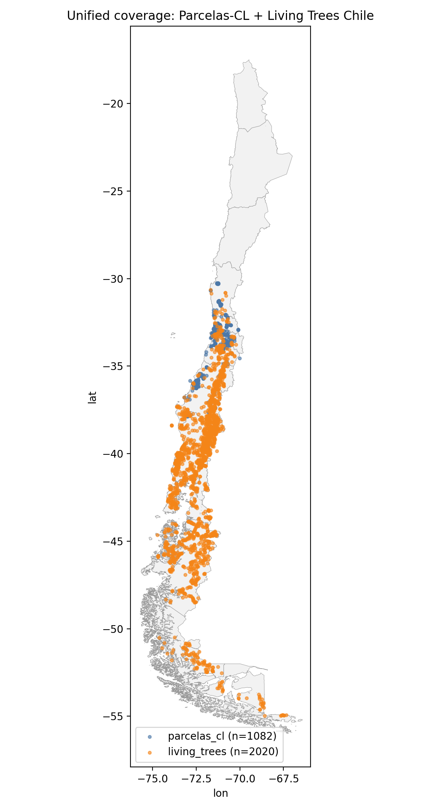
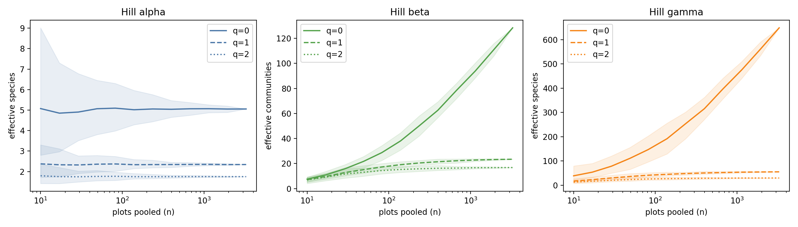
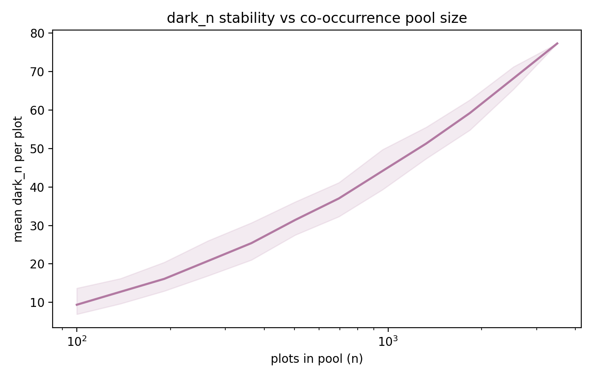
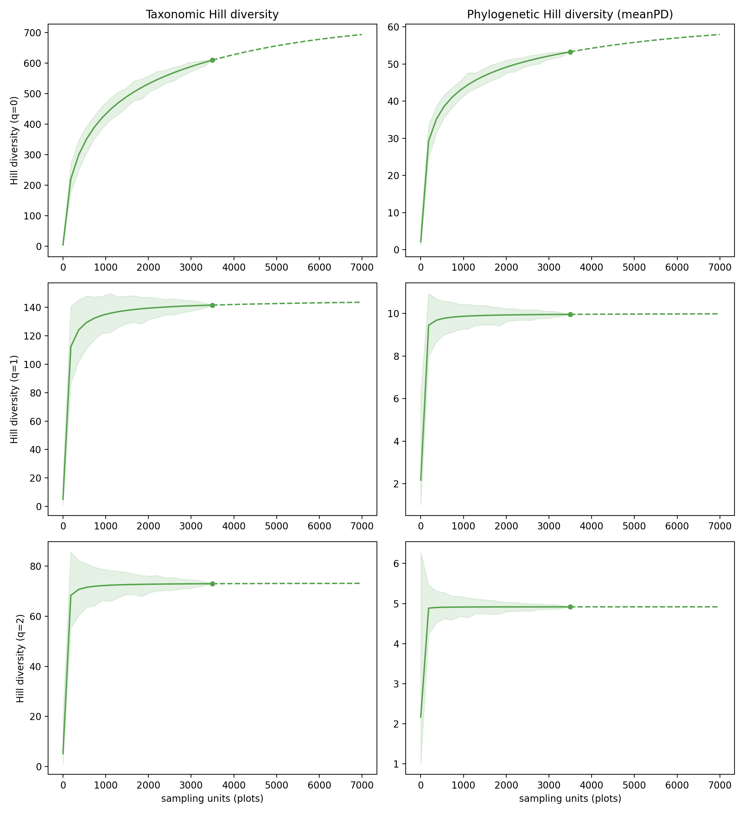

# Alcance

Base de datos unificada (Parcelas-CL, 1.485 parcelas de vegetación, Chile central,
30-38°S + Living Trees Chile, 2.020 parcelas de inventario forestal, cobertura
nacional). Este documento resume el método y las librerías usadas para estimar cada
faceta de biodiversidad sobre esa base unificada.

# Métodos

## Diversidad taxonómica (riqueza)

Número de Hill de orden q=0. `hillR::hill_taxa(comm, q=0)`.

## Beta diversidad — presencia/ausencia

Contribución local a la beta diversidad (LCBD, Legendre & De Cáceres 2013) sobre
matriz binaria. `adespatial::beta.div(method="jaccard", nperm=999)`. Composición:
`vegan::vegdist(method="jaccard", binary=TRUE)` → `ape::pcoa(correction="cailliez")`,
2 ejes.

## Beta diversidad — frecuencia

Mismo método que arriba, pero sobre abundancia relativizada por fila (cobertura,
conteo o área basal — se excluye solo la cepa de presencia pura, sin magnitud).
Relativización: `vegan::decostand(method="total")`. LCBD:
`adespatial::beta.div(method="hellinger", nperm=999)`. Composición:
`vegan::vegdist(method="bray")` → `ape::pcoa(correction="cailliez")`.

## Partición de Hill alfa/beta/gamma (q=0,1,2)

Partición multiplicativa de Hill (Chao, Chiu & Jost 2014, β=γ/α).
`hillR::hill_taxa_parti(comm, q, rel_then_pool=TRUE)` — relativiza cada parcela por
fila antes de poolear, lo que permite combinar cobertura/conteo/área basal sin
convertir todo a una sola unidad. Curva por remuestreo: 12 tamaños log-espaciados,
100 submuestras por tamaño, media ± banda percentil 2,5-97,5%.

## Diversidad filogenética

Árbol: `V.PhyloMaker2::phylo.maker(scenarios="S3")`, megaárbol `GBOTB.extended.TPL`.
Métricas: `picante::pd/mpd/mntd` y sus versiones de tamaño de efecto estandarizado
`ses.pd/ses.mpd/ses.mntd` (modelo nulo `"taxa.labels"`, `runs=499`,
`include.root=FALSE`).

## Dark diversity

`DarkDiv::DarkDiv(method="Hypergeometric")`, umbral de pertenencia 0,9, sobre el pool
de co-ocurrencia completo (no solo las parcelas reportadas). Curva de estabilidad por
remuestreo (empírica, sin fórmula de referencia): 12 tamaños de pool, 100 submuestras
por tamaño, `dark_n` medio de cada submuestra.

## Curvas de rarefacción/extrapolación (Hill, q=0,1,2)

Taxonómica: `iNEXT.3D::iNEXT3D(diversity="TD", q=c(0,1,2), datatype="incidence_raw")`.
Filogenética: reimplementación propia (`scripts/lib/pd_inext.R`) portada del código
fuente de `iNEXT.3D` (no derivada de memoria), validada contra `iNEXT.3D` a precisión
de 1,4e-13 de error relativo.

## Esquema de validación cruzada

Bloques espaciales de 20×20 km, 5 folds (`kfold5_block20_unified`), sobre proyección
Lambert Azimuthal Equal-Area centrada en Chile (evita la distorsión de la UTM19S
nativa lejos de su meridiano central).

# Librerías

## R (4.6.1)

| Paquete | Versión | Uso |
|---|---|---|
| `hillR` | 0.5.2 | Números de Hill, partición alfa/beta/gamma |
| `adespatial` | 0.3.29 | LCBD (`beta.div`) |
| `vegan` | (dependencia) | `vegdist`, `decostand` |
| `ape` | 5.8.1 | PCoA, manejo de árboles filogenéticos |
| `picante` | 1.8.2 | `pd`, `mpd`, `mntd`, `ses.*` |
| `V.PhyloMaker2` | 0.1.0 | Construcción del árbol filogenético |
| `DarkDiv` | 0.3.0 | Dark diversity |
| `iNEXT.3D` | 1.0.12 | Curvas de rarefacción/extrapolación taxonómica; referencia de validación de la reimplementación filogenética |

## Python (3.11.6)

| Paquete | Versión | Uso |
|---|---|---|
| `pandas` | 1.5.3 | Construcción y unificación de los datos |
| `pyproj` | 3.5.0 | Reproyección de coordenadas |
| `geopandas` | 0.14.0 | Mapas |

`iNEXT.beta3D` se evaluó para la curva de beta diversidad y se descartó: resuelve
comparación entre grupos predefinidos de tamaño fijo, no una curva de acumulación por
pooling creciente de parcelas.

# Resultados

n = 3.102 parcelas unificadas (1.082 Parcelas-CL + 2.020 Living Trees), 593 especies.

## Taxonómica y beta diversidad

- Riqueza (`hill_q0`): media 4,85, mediana 4, máximo 50 especies/parcela.
- Presencia/ausencia: 3.094/3.102 parcelas, 593 especies. PCoA (2 ejes) explica
  12,9% de la varianza.
- Frecuencia (cobertura/conteo/área basal relativizados): 3.040/3.102 parcelas
  (62 excluidas por ser presencia pura), 584 especies. PCoA (2 ejes) explica 7,0% de
  la varianza — ambos porcentajes bajo el umbral de alerta del 20%, señal de alta
  dimensionalidad/turnover, no un error de cómputo.
- Correlación entre el primer eje de presencia/ausencia y el de frecuencia: 0,907
  (magnitud alta, signo arbitrario por corrida de PCoA — ambas rutas de composición
  concuerdan).

## Partición de Hill (alfa/beta/gamma), pool de 3.273 parcelas × 649 especies

| q | alfa | beta | gamma |
|---|---|---|---|
| 0 (riqueza) | 5,05 | 128,4 | 649,0 |
| 1 (Shannon) | 2,34 | 23,5 | 55,0 |
| 2 (Simpson) | 1,75 | 16,8 | 29,5 |

β decrece fuertemente con q (turnover concentrado en especies raras), patrón
esperado.

## Diversidad filogenética

Árbol de 610 especies (338 en posición propia, 55%; 272 injertadas por género, 45%).
`pd_faith` correlaciona 0,894 con la riqueza (descriptor, no señal independiente).
563/3.102 parcelas quedan sin `mpd`/`mntd` por tener <2 especies en el árbol.

## Dark diversity

`dark_n` correlaciona (Spearman) +0,176 con la riqueza — prácticamente ortogonal, no
es riqueza reetiquetada. `completeness` correlaciona +0,950 — sí es riqueza
reetiquetada, se usa solo como descriptor.

Curva de estabilidad: `dark_n` medio pasa de 9,4 (pool de 100 parcelas) a 77,3 (pool
completo, 3.497 parcelas) — la estimación sigue moviéndose fuertemente con el tamaño
del pool, lo que confirma cuantitativamente por qué se usa siempre el pool completo.

## Curvas de rarefacción/extrapolación (observado → 2n)

| q | taxonómica | filogenética (meanPD) |
|---|---|---|
| 0 | +13,7% | +8,7% |
| 1 | +1,4% | +0,3% |
| 2 | +0,2% | +0,0% |

La ganancia de extrapolación se achica fuertemente al subir q — a q=1,2 el muestreo
ya está cerca de su asíntota, como se espera cuando el peso recae en las especies
dominantes.

